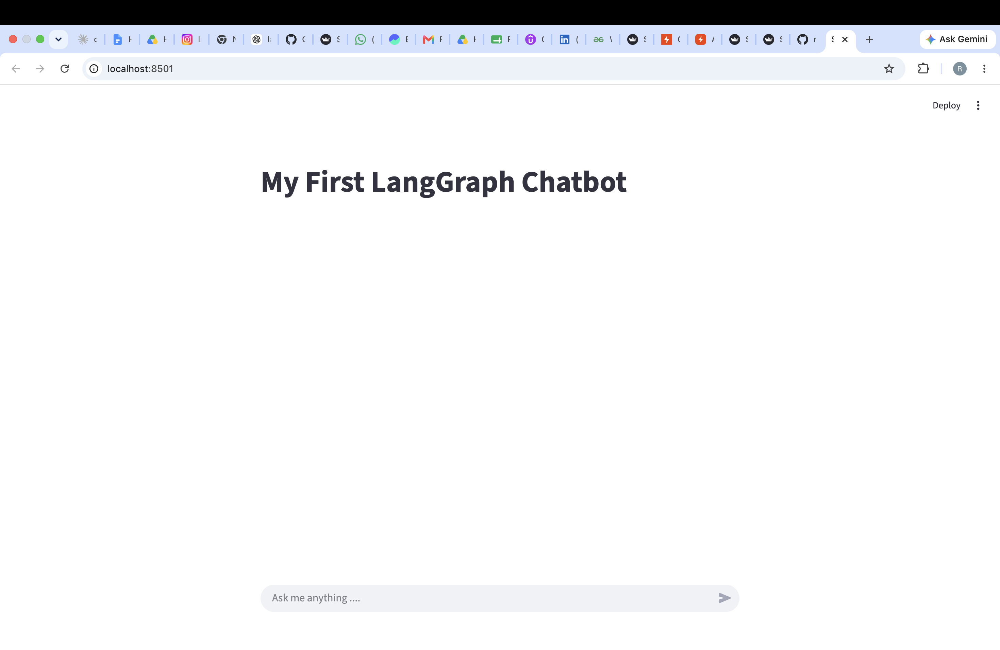

# 🤖 First LangGraph ChatBot

A simple AI chatbot built using **LangGraph**, **LangChain**, **Groq (Llama 3.1)**, and **Streamlit**.

This project marks the beginning of my LangGraph learning journey. The goal is to understand the core concepts first and gradually build more advanced AI applications by adding memory, tools, RAG, and agentic workflows.

---

## 🚀 Features

- Interactive chatbot built with Streamlit
- LangGraph workflow with a single chatbot node
- Groq Llama 3.1 integration
- Environment variables using `.env`
- Clean and beginner-friendly code structure

---

## 🏗️ Architecture

```
User
   │
   ▼
State
   │
   ▼
Chatbot Node
   │
   ▼
Groq (Llama 3.1)
   │
   ▼
Response
```

---

## 🛠️ Tech Stack

- Python
- LangGraph
- LangChain
- Groq
- Streamlit
- Git
- GitHub

---

## 📂 Project Structure

```
First-LangGraph-ChatBot
│
├── .venv/
├── .env
├── .gitignore
├── app.py
├── requirements.txt
├── README.md
├── LICENSE
└── images/
```

---

## 🚀 Installation

```bash
git clone https://github.com/maitraria15-dot/First-LangGraph-ChatBot.git

cd First-LangGraph-ChatBot

python3 -m venv .venv

source .venv/bin/activate

pip install -r requirements.txt
```

---

## ▶️ Run the Application

```bash
streamlit run app.py
```

---

## 📸 Demo



---

## 🔮 Roadmap

- ✅ Basic LangGraph Chatbot
- ⬜ Conversation Memory
- ⬜ Multiple Nodes
- ⬜ Conditional Routing
- ⬜ Tool Calling
- ⬜ Web Search
- ⬜ RAG
- ⬜ Multi-Agent Workflow

---

## 👨‍💻 Author

**Ria Maitra**

Learning LangGraph one project at a time.

---

## ⭐ Support

If you found this project useful, consider giving it a ⭐ on GitHub.